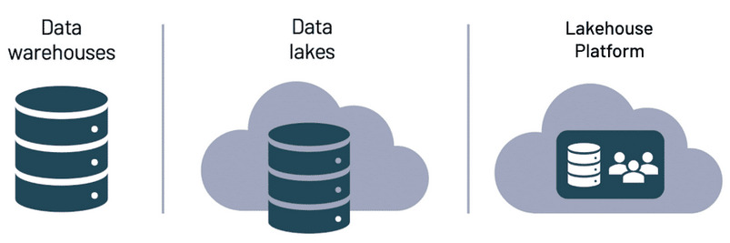

<!-- 
_class: invert 
_paginate: false
-->

#  <!--fit-->  Fundamentals of Big Data

--- 
# Where does big data come from?
#
- Human-generated
  - Social media posts, Emails, Audio files
- Machine-generated
  - Secuirty cameras, Satelities, Sensors on vehicles
- Organization-generated
  - Transactional data
  - Purchase at an online or physical store

---
# When is data considered to be big?
## Three V's

- **Volume**: the amount of data being generated
  - According to IDC, the amount of data exists in the world is growing from 33 zettabytes in 2018 to 177 zettabytes by 2025
- **Variety**: the different types of data generated
  - Different types of data
- **Velocity**: the speed at which data is generated
  - Example: social media post going viralin seconds

---
# Types of Big Data
### Structured
- Any data that conforms to a certain format or schema
  - spreadsheet
 
### Unstructured
- "Messy" data, most widespread type of data
- 90% of data today is unstructured
  - videos, photographs, emails, audio files, images
  
### Semi-structured
- It does have some level of organization
  - HTML code 

---
<!-- _class: invert 
_paginate: false
-->

# An introduction to Distributed Computing

---
# Why distributed computing?

- Process big data by splitting big data into more manageable chunks and distributes the work among computers
  
# What is distributed computing?

- A system that divide the data into smaller chunks and distribute it among different computers, process in parellel
- *Apache Spark* is an example to  process big data 

# Apache Spark process

- Job, Driver and Simple Executors

---
#  Batch x Streaming Processing

### Batch
- *batch*: group of same objects, amount, array, bunch
- Is data that we have in **storage** ant that we process **all at once**
- Example: telecommunication companies process cellular phone usage each month to gerenate our monthly phone bills  

### Streaming
- Is being **continually** produced by one or more sources and must be processed **incrementally** as it arrives
- Example: how heart monitors work

  > Streaming data is used for things link **fraud detection**

---
# Data Storage Systems
#
#

---
# Data warehouses

- **Benefits of data warehouses**:

    - Work well for **structured data** and are reliable. 

    - Data is typically clean and easy to query.

- **Challenges with data warehouses**:

    - They can be hard and expensive to scale (if you need more space, for example).

    - You often have to deal with vendor lock-in. This occurs when your data is stored in a system that does not belong to you. 

    - Data warehouses are very expensive to build, license and maintain.

---
# Data lakes

- **Benefits of data lakes**:

    - The ability to hold different types of data

    - They’re easier to scale since they are usually cloud-based and they rely on cloud storage, which is cheap. 
  
    - You pay to store your data in a data lake, but only pay for computer costs once you need to do something with it. 

- **Challenges with data lakes**:

    - Individuals unfamiliar with working with raw data can experience a bit of a learning curve or difficulties navigating a data lake.
    
    - Due to larger volumes of data and the occasional lack of structure, query speeds can be impacted in traditional data lakes.

---
# Lakehouse platform

- All benefits of data lakes and data warehouses wrapped up in a platform that data teams can work in together
- Single source of truth for your data
- A third party maintaining your own physical infrastructure
- Easily scalable

---
<!-- _class: invert -->

# Techniques for Working with Big Data
 ---
 <!-- _theme: uncover -->

